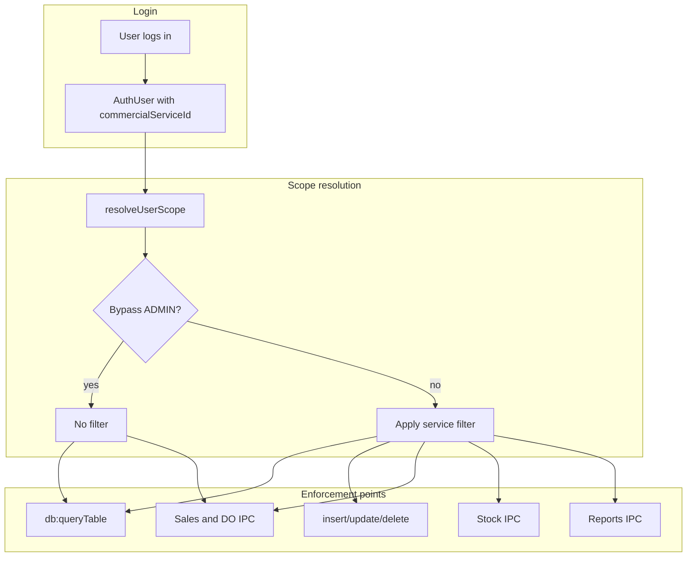

# Commercial service scoping plan

## Policy (confirmed)

| Rule                          | Choice                                                                                                                                                                                                 |
| ----------------------------- | ------------------------------------------------------------------------------------------------------------------------------------------------------------------------------------------------------ |
| Bypass filter                 | **ADMIN only** — all other roles are scoped                                                                                                                                                            |
| Sale / delivery order service | **Logged-in user's** `commercialServiceId`                                                                                                                                                             |
| Cross-service checks          | Customer and product on a transaction **must belong to the same service** as the user (reject mismatches)                                                                                              |
| Stock                         | **Per-service isolation** — stock screens show only products (and derived balances/movements) for the user's service; physical stock tables stay as-is, scoped via `Product.commercialServiceId` joins |



---

## Phase 1 — Core scope infrastructure

Add a single backend module, e.g. [`src/electron/auth/userScope.ts`](src/electron/auth/userScope.ts):

```ts
export interface UserScope {
  userId: string;
  role: string;
  commercialServiceId: string | null;
  bypassCommercialServiceFilter: boolean; // role === 'ADMIN'
}

export function resolveUserScope(user: AuthUser): UserScope;
export function requireCommercialServiceId(scope: UserScope): string; // throws if missing
export function assertSameCommercialService(scope, recordServiceId): void;
```

**Behavior for non-admin without `commercialServiceId`:** block mutating operations and show a clear error (“User has no commercial service assigned”). Allow read-only org screens only where safe, or block login in [`src/electron/auth/session.ts`](src/electron/auth/session.ts) at login time (recommended: fail login with message so misconfigured users are caught early).

Extend [`src/electron/auth/requireUser.ts`](src/electron/auth/requireUser.ts) with `requireAuthScope(authToken)` returning `UserScope`.

**Optional session enrichment (UI):** add `commercialServiceName` to login response in [`src/electron/auth/session.ts`](src/electron/auth/session.ts) and [`src/shared/database.types.ts`](src/shared/database.types.ts) for header/display (join `CommercialService.name` once at login).

---

## Phase 2 — Generic DB layer (highest leverage)

Today [`db:queryTable`](src/electron/ipc/database.ts) is **unauthenticated** and [`queryTable`](src/electron/db/tableQuery.ts) has no filters. Most list screens (`CustomersScreen`, `ProductsScreen`, `UsersScreen`, etc.) depend on this.

### 2a. Authenticate reads

- Add `authToken?: string` to [`TableQueryInput`](src/shared/database.types.ts).
- Update [`getAuthenticatedDb().queryTable`](src/ui/auth/db.ts) to pass token (mirror insert/update).
- In [`registerDatabaseHandlers`](src/electron/ipc/database.ts): `requireAuthScope` before `queryTable`.

### 2b. Table scope registry

Add [`src/electron/db/commercialServiceScope.ts`](src/electron/db/commercialServiceScope.ts) defining per-table strategy:

| Strategy               | Tables (initial set)                                                                                           |
| ---------------------- | -------------------------------------------------------------------------------------------------------------- |
| **Filter by column**   | `Customer`, `Product`, `User`, `TaxRegime`, `Factory`, `Sale`, `DeliveryOrder`                                 |
| **Self only**          | `CommercialService` — scoped users see `WHERE id = ?`                                                          |
| **Org-wide**           | `CompanySettings`, `ProductCat`, `SalesPoint`, `StorageLocation`, `FinancialYearPeriod`, `PaymentMethod`, etc. |
| **Indirect (Phase 3)** | Stock header/line tables via product join subquery                                                             |

For scoped users, append to SQL in `queryTable`:

```sql
AND commercialServiceId = ?
```

For **Product**, also include shared catalog rows if desired:

```sql
AND (commercialServiceId IS NULL OR commercialServiceId = ?)
```

(Document this rule; default: **strict** — only user's service, no NULL escape hatch, unless you prefer shared products.)

### 2c. Write-path enforcement

In [`src/electron/db/tableMutations.ts`](src/electron/db/tableMutations.ts) (called from IPC after `assertTableWrite`):

- **Insert:** force `commercialServiceId` to user's service for scoped tables; reject if client sends a different value.
- **Update:** prevent changing `commercialServiceId`; prevent updating rows belonging to another service (SELECT existing row first).
- **Delete:** verify row belongs to user's service before delete.
- **User table:** non-admin can only manage users in same service; ADMIN unrestricted.

---

## Phase 3 — Transaction services (Sales + Delivery Orders)

### Sales — [`src/electron/sales/service.ts`](src/electron/sales/service.ts)

Current gap: `INSERT INTO Sale` (line ~1271) **does not set** `commercialServiceId` / snapshots even though columns exist in schema ([`001_init.sql`](src/electron/db/migrations/001_init.sql)).

Changes:

1. Load user scope from `input.userId` → resolve `commercialServiceId` + service name/phone/address snapshots.
2. Extend `INSERT INTO Sale` with `commercialServiceId`, `commercialServiceNameSnapshot`, issuer snapshots (match delivery-order pattern).
3. In `getSalesFormOptions` / customer load: filter customers to user's service.
4. On line product pick: assert `Product.commercialServiceId` matches user service.
5. Add service filter to **unscoped** handlers in [`src/electron/ipc/sales.ts`](src/electron/ipc/sales.ts): `listSales`, `listPendingSales`, `loadSaleByInvoiceNo` — pass `userId` or `authToken` and filter.

### Delivery orders — [`src/electron/deliveryOrders/service.ts`](src/electron/deliveryOrders/service.ts)

Replace hardcoded:

```697:699:src/electron/deliveryOrders/service.ts
  const commercialService = db
    .prepare(`SELECT id, name, phone, address FROM CommercialService WHERE isActive = 1 LIMIT 1`)
```

With: load from **acting user's** `commercialServiceId` (via `userId` on save — wire through [`SaveDeliveryOrderInput`](src/shared/deliveryOrders.types.ts) if not already present).

Also:

- Filter `getDeliveryOrdersFormOptions` customers/products/tax regimes by service.
- Scope `listDeliveryOrders`, `listPending`, validation queue, load-by-no.
- Validate customer service on save.

---

## Phase 4 — Stock module (per-service screens)

Stock tables (`StockReceipt`, `StockTransfer`, `StockMovement`, etc.) have **no** `commercialServiceId` column. Scope **via product**:

In [`src/electron/stock/service.ts`](src/electron/stock/service.ts):

- Extend `productFilterSql` / bootstrap product queries to add:

```sql
AND (p.commercialServiceId IS NULL OR p.commercialServiceId = ?)
```

(or strict `= ?` per policy)

- Apply in: `getStockBootstrap`, `listOnHandAsOf`, `getBinCard`, receipt/transfer/adjustment save & list, validation/receive queues ([`validationQueue.ts`](src/electron/stock/validationQueue.ts), [`receiveQueue.ts`](src/electron/stock/receiveQueue.ts)).
- On save: reject lines whose products are outside user's service.
- [`src/electron/ipc/stock.ts`](src/electron/ipc/stock.ts): resolve scope from `userId` consistently (replace bare string checks with `requireAuthScope` lookup).

**“Different screens per service”:** keep existing routes [`stock`](src/ui/navigation/schemaRoutes.ts) and [`bottled-stock`](src/ui/navigation/schemaRoutes.ts) (bulk vs bottled UI split). Service isolation is **data-level** within those screens, not new routes per service. Optionally later: use `CommercialService.siteKind` (`SALES_POINT` vs `FACTORY`) to toggle factory-specific stock UX — out of scope for v1 unless needed.

Stock reports ([`stockReport.ts`](src/electron/reports/stockReport.ts), [`stockCommitment.ts`](src/electron/reports/stockCommitment.ts)): filter `loadProducts()` / balances to scoped products when `userId` is not ADMIN.

---

## Phase 5 — Reports and dashboard

Reports already receive `user.id` in many IPC handlers ([`src/electron/ipc/reports.ts`](src/electron/ipc/reports.ts)). Extend **data queries**, not only [`loadReportCompanySettings`](src/electron/reports/companySettings.ts) (header `serviceName`).

| Report area           | Filter approach                                                                                |
| --------------------- | ---------------------------------------------------------------------------------------------- |
| Sales-based reports   | `Sale.commercialServiceId = ?`                                                                 |
| Delivery / commitment | Join customer or DO `commercialServiceId`                                                      |
| Stock reports         | Product service filter (Phase 4)                                                               |
| Budget crosstabs      | Org-wide or service-specific — default **org-wide** unless budgets gain a service column later |

Fix reports that pass `undefined` for userId today (e.g. [`dailySalesReport.ts`](src/electron/reports/dailySalesReport.ts), [`monthlyPalmOilSalesReport.ts`](src/electron/reports/monthlyPalmOilSalesReport.ts)) so scoped users always pass `userId`.

Dashboard ([`src/electron/dashboard/summary.ts`](src/electron/dashboard/summary.ts)): add service filter to revenue/stock tiles for non-admin.

---

## Phase 6 — UI adjustments

Minimal UI work once backend enforces scope:

| Screen                                                                                                                            | Change                                                              |
| --------------------------------------------------------------------------------------------------------------------------------- | ------------------------------------------------------------------- |
| [`UserFormModal.tsx`](src/ui/users/UserFormModal.tsx)                                                                             | ADMIN: full service picker; others: locked to own service on create |
| [`CustomerFormModal.tsx`](src/ui/customers/CustomerFormModal.tsx), [`ProductFormModal.tsx`](src/ui/products/ProductFormModal.tsx) | Default/hide `commercialServiceId` for non-admin                    |
| App shell                                                                                                                         | Show current commercial service name (from enriched session)        |
| Sales / DO UI                                                                                                                     | Remove cross-service options automatically when lists are filtered  |

No need to duplicate filter logic in every screen if Phase 2 is complete.

---

## Phase 7 — Data hygiene and migration

One-time script or migration helper:

1. Ensure every **User** (except ADMIN) has `commercialServiceId` set.
2. Backfill **Sale** rows: set `commercialServiceId` from `createdByUserId` → User, or from Customer.
3. Backfill **DeliveryOrder** from customer or creator where currently wrong/`LIMIT 1` service.
4. Audit **Product** / **Customer** with NULL or mismatched service IDs.

Add admin-only “Commercial service data audit” report or console script listing orphans.

---

## Phase 8 — Testing and rollout

**Unit/integration focus:**

- Scoped user cannot `queryTable('Customer')` see other service's rows.
- Scoped user cannot insert customer with foreign `commercialServiceId`.
- ADMIN sees all rows.
- Sale create stamps user service; rejects customer from other service.
- DO no longer uses `LIMIT 1` service.
- Stock bootstrap excludes other-service products.
- Report totals differ per service user vs ADMIN aggregate.

**Rollout:** deploy backend phases 1–3 first (security), then stock/reports, then UI polish. Run data backfill before enabling strict login block for users without service.

---

## Key files to touch (summary)

- New: `src/electron/auth/userScope.ts`, `src/electron/db/commercialServiceScope.ts`
- Auth/DB: [`session.ts`](src/electron/auth/session.ts), [`requireUser.ts`](src/electron/auth/requireUser.ts), [`database.ts`](src/electron/ipc/database.ts), [`tableQuery.ts`](src/electron/db/tableQuery.ts), [`tableMutations.ts`](src/electron/db/tableMutations.ts)
- Transactions: [`sales/service.ts`](src/electron/sales/service.ts), [`deliveryOrders/service.ts`](src/electron/deliveryOrders/service.ts), IPC wrappers
- Stock: [`stock/service.ts`](src/electron/stock/service.ts), queues, [`ipc/stock.ts`](src/electron/ipc/stock.ts)
- Reports: all `get*Report(userId)` modules under [`src/electron/reports/`](src/electron/reports/)
- UI: [`ui/auth/db.ts`](src/ui/auth/db.ts), form modals, optional shell indicator
- Types: [`shared/database.types.ts`](src/shared/database.types.ts)

---

## Out of scope (v1)

- Per-service permission matrix (old `CommercialServiceRole` was removed)
- Dynamic nav routes per service (use data filtering within existing routes)
- `salesPointId` as a second scope dimension (can be Phase 2 enhancement)
- Mobile/API clients unless they share the same IPC layer
