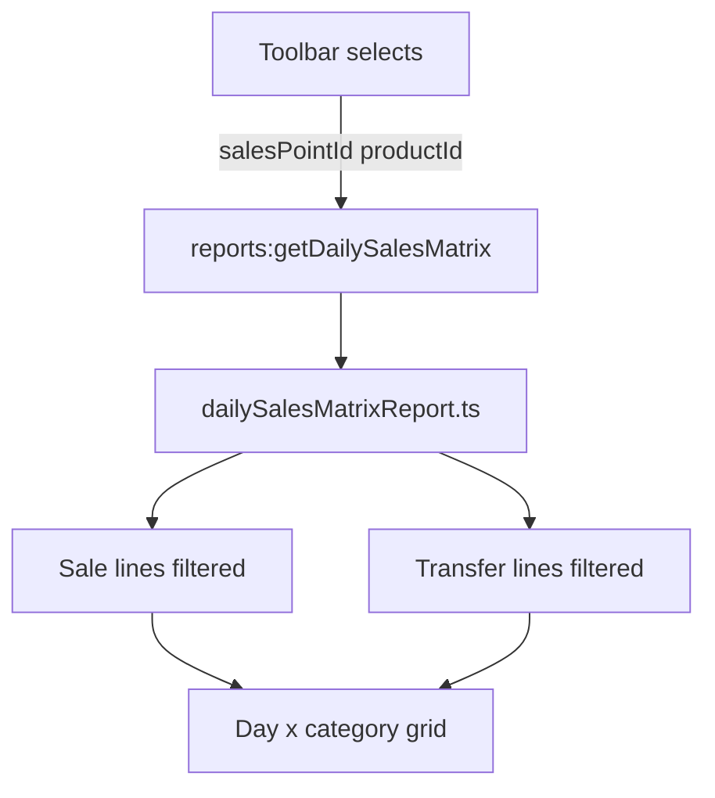

# Daily sales matrix report (spreadsheet layout)

## Goal

Add a **second** report alongside the existing [`daily-sales-report`](src/ui/navigation/schemaRoutes.ts) that renders a month grid like the spreadsheet:

| DAY | INDUSTRY | WHOLE SALE | RETAIL | CDC/WORKER | STAFF | TRNSFR | TOTAL |
|-----|----------|------------|--------|------------|-------|--------|-------|
| 1…31 | qty | qty | qty | qty | 0 | qty | row sum |
| **TOTAL** | col sum | … | … | … | 0 | … | grand total |

**Keep** [`DailySalesReportScreen.tsx`](src/ui/reports/DailySalesReportScreen.tsx) (SN / customer / DO detail) as-is.

## User filters (toolbar)

Two **select** controls drive all report data:

| Filter | UI | Backend param | Default | Effect |
|--------|-----|---------------|---------|--------|
| **Collection point** | `<select>` | `salesPointId: number \| null` | All collection points | Sales: `Sale.salesPointId`. TRNSFR: `StockTransfer.fromSalesPointId` (qty out) |
| **Product** | `<select>` | `productId: number \| null` | All products | Sales: `SaleLine.productId`. TRNSFR: `StockTransferLine.productId` |

- Options loaded from report payload: `salesPointOptions`, `productOptions` (active products via [`loadProducts()`](src/electron/reports/shared.ts), sorted by name).
- Changing either select **reloads** the report (same pattern as collection point on [`DailySalesReportScreen.tsx`](src/ui/reports/DailySalesReportScreen.tsx)).
- CSV / print / PDF reflect the **current filter labels** (collection point name + product name in export header).



## Confirmed rules

| Topic | Decision |
|-------|----------|
| Period | Open financial month (`resolveReportAsAt()` → `period.startDate` … `min(asAtIso, period.endDate)`) |
| Collection point filter | Optional; see table above |
| Product filter | Optional; when set, only that product’s quantities appear in all sale columns and TRNSFR |
| Sale columns | Reuse `resolveDailyCustomerCategory()` from shared daily sales helpers → INDUSTRY / WHOLE SALE / RETAIL / CDC/WORKER |
| STAFF | **0 for v1** (column present) |
| TRNSFR | Inter–collection-point transfer qty out (`StockTransfer` DISPATCHED/RECEIVED, `fromSalesPointId != toSalesPointId`) |
| Empty cells | Show `0` to match spreadsheet |
| Quantities | Sales: bottled → units, loose → kg (same as detail report); Transfers: line qty in kg |

---

## Phase 1 — Types and backend builder

### Shared types [`src/shared/reports.types.ts`](src/shared/reports.types.ts)

Add to `DailySalesMatrixReport`:

```ts
selectedSalesPointId: number | null;
salesPointLabel: string;
salesPointOptions: Array<{ id: number; name: string }>;

selectedProductId: number | null;
productLabel: string;
productOptions: Array<{ id: number; name: string; productCode: string | null }>;
```

Plus `DailySalesMatrixDayRow`, `rows`, `columnTotals`, `grandTotal`, month metadata (unchanged from prior plan).

### Shared helpers [`src/electron/reports/dailySalesShared.ts`](src/electron/reports/dailySalesShared.ts)

Extract from [`dailySalesReport.ts`](src/electron/reports/dailySalesReport.ts):

- `resolveDailyCustomerCategory()`
- `lineQuantity()`
- `loadRawSaleLinesForRange(fromIso, toIso, salesPointId, productId?)` — add optional `AND sl.productId = ?`

Refactor detail report to call shared range loader with `fromIso === toIso === reportDateIso`.

### Builder [`src/electron/reports/dailySalesMatrixReport.ts`](src/electron/reports/dailySalesMatrixReport.ts)

Signature:

```ts
getDailySalesMatrixReport(
  userId: string,
  salesPointId?: number | null,
  productId?: number | null,
): DailySalesMatrixReport
```

1. Resolve month window from open posting period + as-at.
2. Load and label sales points / products for selects.
3. Aggregate validated sales into day × category buckets (exclude `proSamples` from sale columns).
4. Load TRNSFR with filters:

```sql
-- productId filter: AND tl.productId = ?
-- salesPointId filter: AND t.fromSalesPointId = ?
WHERE t.status IN ('DISPATCHED', 'RECEIVED')
  AND t.fromSalesPointId != t.toSalesPointId
```

5. Build rows 1…`daysInMonth`, footer totals, `loadReportCompanySettings(userId, asAtIso)`.

---

## Phase 2 — IPC and preload

```ts
reports:getDailySalesMatrix(authToken, salesPointId?, productId?)
```

- [`src/electron/ipc/reports.ts`](src/electron/ipc/reports.ts)
- [`src/electron/preload.cjs`](src/electron/preload.cjs)
- [`src/ui/auth/reports.ts`](src/ui/auth/reports.ts) — `getDailySalesMatrix(salesPointId?, productId?)`
- [`src/ui/types/electron.d.ts`](src/ui/types/electron.d.ts)

---

## Phase 3 — UI screen

New [`src/ui/reports/DailySalesMatrixReportScreen.tsx`](src/ui/reports/DailySalesMatrixReportScreen.tsx):

**Toolbar filters** (mirror [`DailySalesReportScreen.tsx`](src/ui/reports/DailySalesReportScreen.tsx) `dsr-filters` layout):

```tsx
<label>Collection point</label>
<select> {/* All collection points + options from report.salesPointOptions */}

<label>Product</label>
<select> {/* All products + options from report.productOptions; show name + code */>
```

- State: `salesPointId`, `productId` (both nullable).
- `useEffect` deps: `[salesPointId, productId]` → reload report.
- Show open month context (read-only): e.g. “March 2026 · through 29 Mar 2026”.
- Matrix table + TOTAL footer; `ReportDocumentShell` + `ReportHeader`.
- CSV includes filter lines: `Collection point:,…` and `Product:,…`.

---

## Phase 4 — Navigation and permissions

- Route id: `daily-sales-matrix-report` (label e.g. **Daily sales summary (matrix)**).
- Wire [`reportBody.tsx`](src/ui/reports/reportBody.tsx), [`reportWindow.ts`](src/shared/reportWindow.ts), permissions (clone daily sales pattern), [`sidebarIcons.ts`](src/ui/navigation/schemaIcons.ts).
- [`reportEmpty.ts`](src/ui/reports/reportEmpty.ts): empty when `grandTotal === 0` (optional full zero grid vs message — default **show grid**).

Existing **Daily sales report** route description → clarify “detail by customer/DO”.

---

## Phase 5 — Testing

- All points + all products → org-wide totals match sum of filtered slices.
- Single product → sale columns and TRNSFR only for that product.
- Single collection point → sales at point + transfers **from** that point only.
- Both filters combined.
- February / 31-day months; as-at mid-month.
- Detail daily sales report still works after shared refactor.

---

## Out of scope (v1)

- STAFF column data
- Commercial-service scoping on filters
- Multi-product combined view beyond “All products”
- Replacing the detail daily sales report
