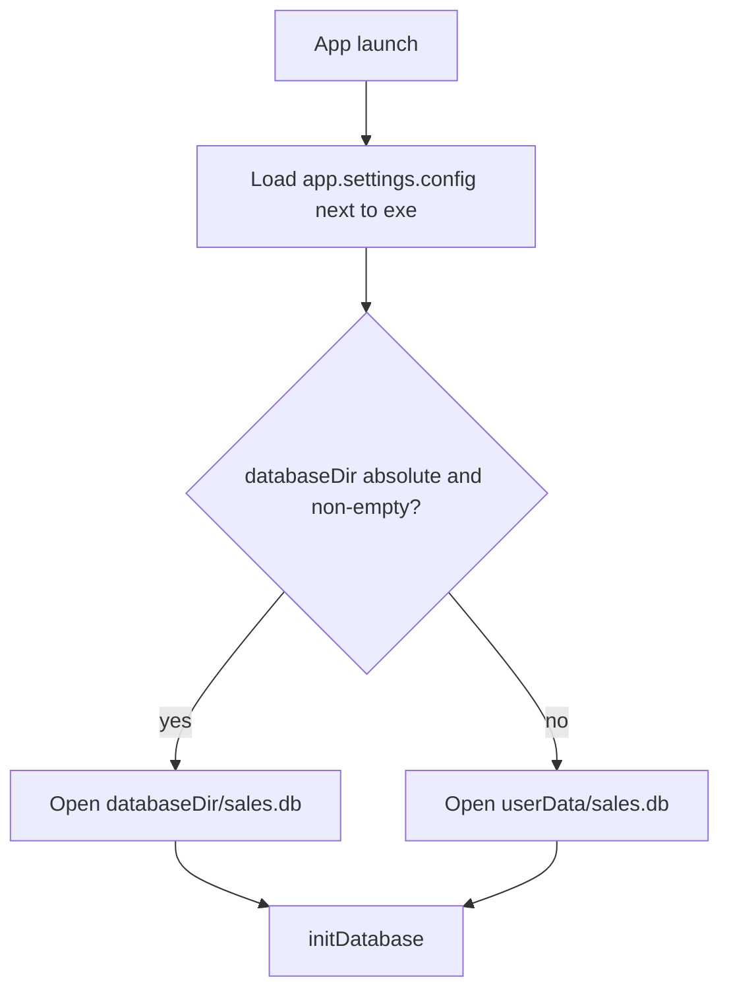

# Application configuration settings file (win-unpacked)

## What you want

A **configuration settings file** ships with the app (inside `win-unpacked`, next to the `.exe`). Users edit that file to control app settings — starting with **where the database directory is**, so on launch `sales.db` is created/opened there instead of only under AppData.

This is an app-level settings file (extensible), not a one-off DB hack.

## Decisions

- **File name:** `app.settings.config` (JSON). Lives only next to the packaged executable.
  - After build: `release/win-unpacked/app.settings.config`
  - After install: `{installDir}\app.settings.config` (e.g. under Program Files or a custom install path)
- **Role:** general **configuration settings** for the desktop app. First setting: database location. More keys can be added later without a new file.
- **Starter schema:**
  ```json
  {
    "databaseDir": ""
  }
  ```

  - Empty / missing `databaseDir` → default `{userData}\sales.db` (today’s behavior).
  - Non-empty absolute directory → create/open `{databaseDir}\sales.db`.
- **Ship with build:** `packaging/app.settings.config` copied via electron-builder `extraFiles` so it always appears in `win-unpacked` and the installed app folder for users to edit.
- **Other app data** (backup schedule JSON, etc.) stays in `userData` unless later settings keys move them.
- **No auto-migrate** of an existing AppData database into a newly configured folder.

## Implementation

### 1. Load settings (shared helper)

Add something like [`src/electron/config/appSettings.ts`](src/electron/config/appSettings.ts):

- Resolve config path: `path.join(path.dirname(app.getPath("exe")), "app.settings.config")` when packaged.
- Dev fallback: look for `app.settings.config` at the project root (or skip → defaults).
- `loadAppSettings(): { databaseDir?: string }` — parse JSON, ignore unknown keys, warn on invalid JSON and return defaults.

### 2. Use `databaseDir` for SQLite

In [`src/electron/db/index.ts`](src/electron/db/index.ts):

- `resolveDatabaseFilePath()` reads `loadAppSettings().databaseDir`.
- If absolute dir set → `path.join(dir, "sales.db")` + `mkdirSync(dir, { recursive: true })`.
- Else → `path.join(app.getPath("userData"), "sales.db")`.
- `initDatabase()` and `getDatabaseFilePath()` both use this (backup already uses `getDatabaseFilePath()`).

### 3. Package into win-unpacked

In [`package.json`](package.json) `build`:

```json
"extraFiles": [
  {
    "from": "packaging/app.settings.config",
    "to": "app.settings.config"
  }
]
```

Add [`packaging/app.settings.config`](packaging/app.settings.config) with empty `databaseDir` so default location is used until edited.

### 4. Docs

Brief note in [`docs/user-guide/11-data-backup-restore.md`](docs/user-guide/11-data-backup-restore.md) (and/or troubleshooting):

- Configuration settings file: `app.settings.config` beside the `.exe`
- Set `"databaseDir"` to an absolute folder path, save, restart
- Leave empty to use the default AppData database

## Flow



## Out of scope (for this change)

- In-app UI to edit settings
- Moving entire `userData` into the settings file
- Concurrent multi-PC SQLite on a network share
- Extra settings keys beyond `databaseDir` (file structure allows them later)
