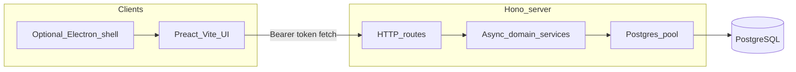

# Split app: Hono backend + PostgreSQL + same frontend architecture

## Target architecture

**Chosen defaults:**

- **PostgreSQL** as the system of record (`DATABASE_URL`) — real concurrent writers, row-level locking, transactions across users/PCs.
- Driver: **`postgres` (postgres.js)** with a small async `Db` helper (query / queryOne / execute / transaction).
- Keep the UI contract as today’s [`ElectronAppApi`](src/ui/types/electron.d.ts); HTTP client mirrors the same namespaces/methods.
- **Bearer session token** on every mutating and sensitive read (fix IPC holes that trust client `userId` / open reads).
- Ship **browser UI + Hono + Postgres** first; optional Electron shell later talks to the **same** API (no per-machine SQLite in the multiuser path).

## Why Postgres changes the work

Today the app is built around **sync** `better-sqlite3` (`prepare` / `get` / `all` / `run` / `exec`) and **SQLite SQL** (~94 files under [`src/electron/db/migrations`](src/electron/db/migrations), plus programmatic migrations in [`src/electron/db/index.ts`](src/electron/db/index.ts)).

Moving to Postgres means:

1. **Async** domain layer end-to-end (Hono handlers `await` services).
2. **Dialect port**: `AUTOINCREMENT` → `GENERATED`/`SERIAL`, `TEXT` dates stay or become `timestamptz`, `datetime('now')` → `NOW()`, `INSERT OR IGNORE` → `ON CONFLICT DO NOTHING`, `PRAGMA` / SQLite-only rebuild patterns → Postgres equivalents.
3. **One shared server DB** — not `%APPDATA%\sales-electron\sales.db` per Windows user.

SQLite remains only as a **legacy Electron single-PC** option if you keep that product later; it is **out of scope** for the multiuser Hono path.

## What stays vs moves

| Keep as-is | Move to Hono + Postgres | Replace with web adapters |
|---|---|---|
| Preact screens, `HomeScreen` switch, sidebar, CSS | Domain under `src/electron/{auth,sales,stock,reports,…}` → async `src/server/…` | `dialog.*` → `window.confirm` / `alert` |
| `src/shared/*` types & permission helpers | Auth/session/permissions against Postgres | `print.exportPdf` → browser print / download |
| Login UX + `sessionStorage` token | Schema + data access | `windows.openReport` → overlay / new tab + hash |

## Phase 0 — PostgreSQL foundation

1. Add Postgres locally (Docker Compose recommended: `postgres:16`, volume, port `5432`).
2. Env: `DATABASE_URL=postgres://…`
3. Implement `src/server/db/`:
   - connection pool
   - `withTransaction(fn)`
   - migration runner reading Postgres SQL from `src/server/db/migrations/`
4. Port schema:
   - Start from a **Postgres baseline** equivalent to current `001_init` + later applied shape (not a blind replay of every SQLite rebuild migration).
   - Translate seed migrations (`002`–`004`, permission seeds) to Postgres.
   - Collapse obsolete “table rebuild” SQLite migrations into the baseline where already reflected in today’s `001_init`.
5. Optional one-shot **SQLite → Postgres data import** script for existing `sales.db` (export/import tables in FK order) for production cutover.

## Phase 1 — Async domain + Hono API

1. Deps: `hono`, `@hono/node-server`, `postgres`.
2. Port services incrementally to async Postgres queries (auth → db CRUD → sales/stock → reports).
3. Hono structure:
   - `src/server/index.ts` — listen, CORS, JSON errors
   - `src/server/middleware/auth.ts` — Bearer → session user
   - `src/server/routes/*.ts` — namespaces matching preload
4. Route convention:
   - `POST /api/auth/login|session|logout|change-password`
   - `POST /api/<namespace>/<method>` with JSON body ≈ today’s IPC args
5. **Auth hardening:** actor from token only; protect formerly open reads.
6. Scripts: `dev:api`, `build:api`, `start:api`; Vite `VITE_API_BASE_URL`.

## Phase 2 — Frontend transport (same architecture)

1. `createHttpAppApi(baseUrl)` + `getAppApi()` in [`src/ui/auth/client.ts`](src/ui/auth/client.ts).
2. Keep authenticated wrappers (db/reports/dashboard/financialYears).
3. Browser shell adapters for `dialog` / `print` / `windows`.
4. **UI churn goal:** screens unchanged; only client + shell adapters.

## Phase 3 — Multiuser ops

1. Run Postgres + Hono on a LAN/server host; serve `dist-react` from Hono or reverse proxy.
2. Document: connection pooling, backups (`pg_dump`), restore, and that **clients never open the DB file directly**.
3. Optional: Electron loads the web UI / API URL for kiosk installs.

## Risks

- **Largest cost:** converting sync SQLite call sites and SQL dialect — plan vertical slices (auth → sales → stock → reports), not a big-bang rewrite.
- **Security:** network API must authenticate everything; lock CORS/origins.
- **Transactions:** stock post / sale validate paths must use Postgres transactions explicitly (replace better-sqlite3 automatic sync transactions).
- **Report SQL:** many report queries are SQLite-flavored; port/test per report.

## Suggested delivery order

1. Docker Postgres + `DATABASE_URL` + baseline schema migrates cleanly  
2. Auth login/session against Postgres via Hono  
3. One vertical slice (`db.queryTable` / sales list) in the browser  
4. Port remaining domain modules + mirror full `ElectronAppApi`  
5. Auth-harden; shell adapters; production serve + backup runbook  
6. Optional SQLite→Postgres import for existing deployments  
