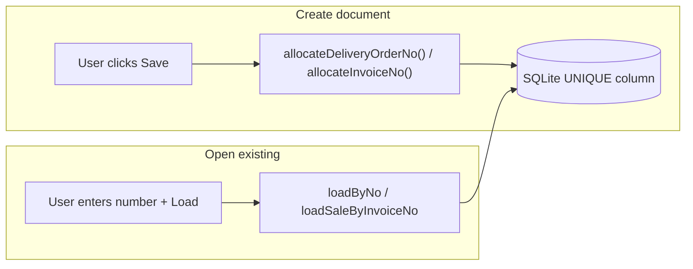
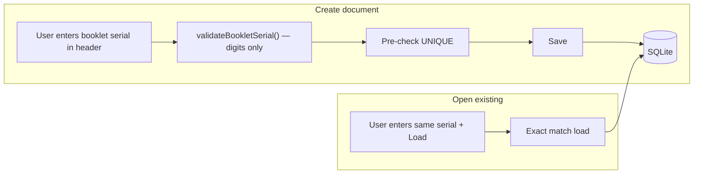

# Manual booklet serial numbers for DOs and invoices

## Current behavior



- **Delivery orders:** [`saveDeliveryOrder()`](c:\Users\user\Desktop\sales-electron\src\electron\deliveryOrders\service.ts) calls [`allocateDeliveryOrderNo()`](c:\Users\user\Desktop\sales-electron\src\electron\deliveryOrders\doNo.ts) on create (line 703). Number is shown only after save.
- **Sales invoices:** [`createSale()`](c:\Users\user\Desktop\sales-electron\src\electron\sales\service.ts) calls [`allocateInvoiceNo()`](c:\Users\user\Desktop\sales-electron\src\electron\sales\invoice.ts) on create (line 709). Number is display-only in the header.
- **Lookup already works:** both screens have an "Open existing" panel that loads by exact `deliveryOrderNo` / `invoiceNo` (trimmed string match). List/search uses `LIKE '%q%'`.
- **DB:** `DeliveryOrder.deliveryOrderNo` and `Sale.invoiceNo` are both `TEXT NOT NULL UNIQUE` — no schema migration needed.

## Target behavior



- User **types the pre-printed serial** (plain digits, e.g. `12345`, `000123`) when creating a new DO or invoice.
- Number is **required on create**, **immutable after save** (same as today for edits).
- **Lookup unchanged** — same field loads an already-saved document by that serial.
- **Carry-forward DOs** keep auto `CF-{year}-{seq}` via [`allocateCarryForwardDeliveryOrderNo()`](c:\Users\user\Desktop\sales-electron\src\electron\commitments\carryForward.ts) — out of scope for manual entry.
- **Legacy auto numbers** (`DO-2026-000001`, `INV-2026-000001`) remain in the DB and stay loadable; only **new** entries must be digit-only.

## Validation rules (shared)

Add a small shared helper, e.g. [`src/shared/bookletSerial.ts`](c:\Users\user\Desktop\sales-electron\src\shared/bookletSerial.ts):

- Trim whitespace.
- Reject empty.
- Accept **digits only** (`/^\d+$/`) — preserves leading zeros (`000123`).
- Optional reasonable max length (e.g. 20) to avoid accidental paste errors.
- On create, explicit duplicate check:
  - DO: `SELECT 1 FROM DeliveryOrder WHERE deliveryOrderNo = ?`
  - Invoice: `SELECT 1 FROM Sale WHERE invoiceNo = ?`
- Return friendly errors: `"Enter the booklet serial number."`, `"Serial must contain digits only."`, `"This serial number is already used."`
- **Lookup/load:** no format validation (so old prefixed records still open).

## Backend changes

### 1. Delivery orders

**Types** — [`src/shared/deliveryOrders.types.ts`](c:\Users\user\Desktop\sales-electron\src\shared/deliveryOrders.types.ts):

```ts
export interface SaveDeliveryOrderInput {
  // ...
  deliveryOrderNo?: string; // required when id is null/undefined
}
```

**Service** — [`src/electron/deliveryOrders/service.ts`](c:\Users\user\Desktop\sales-electron\src\electron\deliveryOrders\service.ts):

- On **create** (`input.id == null`): validate `input.deliveryOrderNo`, check duplicate, use validated value instead of `allocateDeliveryOrderNo(db)`.
- On **update**: ignore any passed number; keep existing `deliveryOrderNo` (already enforced).
- Remove import/usage of `allocateDeliveryOrderNo` (keep file for carry-forward allocator only).

### 2. Sales invoices

**Types** — [`src/shared/sales.types.ts`](c:\Users\user\Desktop\sales-electron\src\shared/sales.types.ts):

```ts
export interface CreateSaleInput {
  // ...
  invoiceNo: string; // required
}
```

**Service** — [`src/electron/sales/service.ts`](c:\Users\user\Desktop\sales-electron\src\electron\sales\service.ts):

- Replace `allocateInvoiceNo(db)` with validated `input.invoiceNo`.
- Same duplicate check before insert.
- Remove import/usage of `allocateInvoiceNo` (function can remain unused or be deleted).

### 3. IPC / preload

No new channels needed — extend existing `deliveryOrders:save` and `sales:createSale` payloads. Mirror type changes in [`src/ui/delivery-orders/types.ts`](c:\Users\user\Desktop\sales-electron\src\ui\delivery-orders\types.ts) and [`src/ui/sales/types.ts`](c:\Users\user\Desktop\sales-electron\src\ui\sales\types.ts).

## UI changes

### Delivery order screen — [`DeliveryOrdersClient.tsx`](c:\Users\user\Desktop\sales-electron\src\ui\delivery-orders\DeliveryOrdersClient.tsx)

- In **Header** section (`1 · Header`), add a required input when `orderId == null`:
  - Label: **Booklet serial no.**
  - Bind to existing `deliveryOrderNo` state (or a dedicated `newBookletNo` state cleared in `resetNew()`).
  - `inputMode="numeric"` / `pattern="\d*"` for UX; validate digits before save.
- Pass `deliveryOrderNo` in `deliveryOrders.save()` on create.
- Update `canSave` to require a valid booklet serial when creating.
- After save, show serial as read-only (as today).
- Update placeholders:
  - Lookup panel: `"12345"` instead of `"DO-2026-000001"`.
- **Open existing order** panel stays as-is.

### Sales invoice screen — [`SalesClient.tsx`](c:\Users\user\Desktop\sales-electron\src\ui\sales\SalesClient.tsx)

- When `!saleId` (new invoice), replace display-only header with an editable **Booklet serial no.** field bound to `invoiceNo` state (cleared in `resetNew()`).
- Pass `invoiceNo` to `sales.createSale()`.
- Block save until serial is valid.
- After save/load, serial is read-only in header.
- Update lookup placeholder from `"INV-2026-000001"` to `"12345"`.

### Lists and print

- [`DeliveryOrdersList.tsx`](c:\Users\user\Desktop\sales-electron\src\ui\delivery-orders\DeliveryOrdersList.tsx) and [`SalesList.tsx`](c:\Users\user\Desktop\sales-electron\src\ui\sales\SalesList.tsx): update search placeholders only — no logic change.
- Print views already render stored numbers — no change.

## Unchanged / out of scope

- Carry-forward DO auto numbering (`CF-*`).
- Linking invoices to DOs by DO serial (already manual on invoice form).
- DB schema migrations.
- Renaming or migrating existing `DO-*` / `INV-*` records.
- User-guide doc updates (can follow separately if desired).

## Test plan

1. **Create DO** with serial `1001` → saves, shows `1001`, appears in DO list.
2. **Load DO** via Open existing → `1001` loads full document.
3. **Duplicate DO** `1001` → clear error, no partial save.
4. **Invalid DO** (`abc`, empty) → blocked in UI and server.
5. **Create invoice** with serial `2001` → same checks as DO.
6. **Load legacy** `DO-2026-000001` / `INV-2026-000001` (seed data) → still opens via lookup.
7. **Carry-forward batch** → still creates `CF-*` DOs automatically.
8. **Sales → Pick DO / Lookup DO** → still finds validated DO by its stored serial (including new digit-only numbers).
