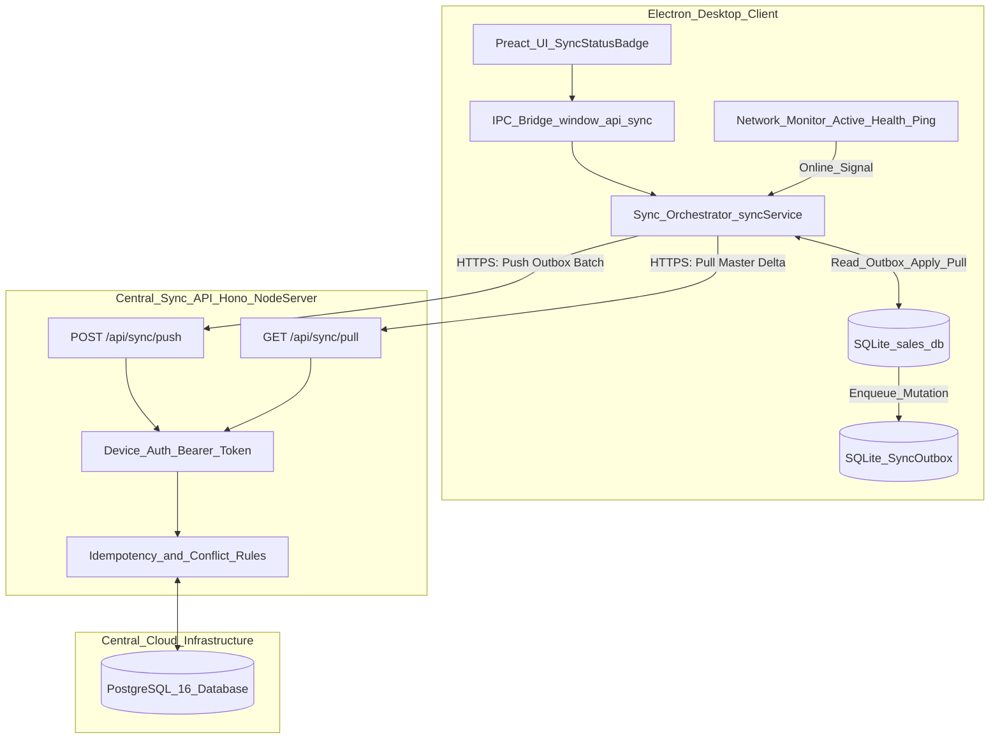

# SQLite to PostgreSQL Synchronization Architecture (with Hono.js Backend)

This plan establishes a resilient, offline-first data synchronization system for the Sales Management Electron application. Each desktop terminal continues running autonomously against its local SQLite database (`better-sqlite3`), and synchronizes automatically with a central PostgreSQL database via a high-performance **Hono.js** web API whenever an active internet connection is detected.

## Architectural Overview



## Key Architectural Principles

- **Offline Autonomy**: Cashiers, storekeepers, and managers never experience delays or app freezes if the internet drops. All reads and writes occur against local SQLite first.
- **Transactional Outbox Pattern**: When a sale, payment, delivery order, or stock movement is committed in SQLite, an entry in `SyncOutbox` is created within the same local transaction. No writes are lost on power failures or app crashes.
- **High-Performance Hono.js Backend**:
  - Extremely lightweight, ultra-low overhead, and first-class TypeScript support.
  - Runs reliably on Node.js using `@hono/node-server` (or containerized on Docker).
  - Built-in composable middleware for CORS, request logging, and Bearer token device authentication.
- **Two-Way Hybrid Sync Model**:
  - **Downstream (Pull)**: Central master data (products, prices, customer catalog, tax schedules, user accounts, permissions) pulls from PostgreSQL into local SQLite based on `updatedAt > lastPulledAt`.
  - **Upstream (Push)**: Local transaction data (sales, sales lines, payments, delivery orders, stock receipts, stock movements) pushes from local SQLite to PostgreSQL via idempotent batch uploads.
- **Deduplication & Conflict Handling**:
  - Global Unique Identifiers (`Sale.id`, `Payment.id`, `StockReceipt.id`) prevent primary key collisions across different sales points and terminals.
  - PostgreSQL's native `ON CONFLICT (id) DO UPDATE SET ...` and `ON CONFLICT DO NOTHING` provide robust idempotency guards.
  - Master data updates adhere to Server-Wins, while transactional movements are append-only.

---

## Phased Implementation Plan

### Phase 1: Shared Interfaces & SQLite Schema Migration

1. **Define Shared Sync Types** in `[src/shared/sync.types.ts](src/shared/sync.types.ts)`:
   - Data structures for outbox items, batch push request/response, pull request/response, sync configuration, and sync connection status (`ONLINE`, `OFFLINE`, `SYNCING`, `ERROR`).
2. **Create SQLite Migration** in `[src/electron/db/migrations/118_sync_outbox_and_state.sql](src/electron/db/migrations/118_sync_outbox_and_state.sql)`:
   - `SyncOutbox`: tracks pending changes with columns (`id`, `entityType`, `entityId`, `action`, `payloadJson`, `status`, `retryCount`, `lastError`, `createdAt`, `syncedAt`).
   - `SyncState`: stores client configuration (`deviceId`, `salesPointId`, `syncServerUrl`, `apiToken`, `lastPulledAt`, `lastPushedAt`, `autoSyncEnabled`).
3. **Add Skip Helper & Startup Handler** in `[src/electron/db/index.ts](src/electron/db/index.ts)`.

### Phase 2: Client Outbox Capture & Event Hooks

1. **Create Outbox Helpers** in `[src/electron/sync/syncOutbox.ts](src/electron/sync/syncOutbox.ts)`:
   - `enqueueOutboxItem(db, entityType, entityId, action, payload)`: inserts JSON serialization into `SyncOutbox`.
   - `getPendingOutboxBatch(db, limit)`: fetches pending rows ordered by ID ascending.
   - `markOutboxItemsSynced(db, itemIds)`: flags items as synced or deletes them.
   - `markOutboxItemFailed(db, itemId, errorMessage)`: increments retry count and sets last error.
2. **Hook Business Services**:
   - `[src/electron/sales/service.ts](src/electron/sales/service.ts)`: enqueue sales, sale lines, taxes, and payments upon validation or creation.
   - `[src/electron/deliveryOrders/service.ts](src/electron/deliveryOrders/service.ts)`: enqueue delivery orders and transfer details.
   - `[src/electron/stock/service.ts](src/electron/stock/service.ts)`: enqueue receipts, movements, transfers, and adjustments.
   - `[src/electron/customers/service.ts](src/electron/customers/service.ts)` / `[src/electron/db/tableMutations.ts](src/electron/db/tableMutations.ts)`: enqueue newly registered local customers.

### Phase 3: Client Sync Engine & Network Monitoring

1. **Create Network Monitor** in `[src/electron/sync/networkMonitor.ts](src/electron/sync/networkMonitor.ts)`:
   - Monitors online/offline network events.
   - Performs active heartbeat pings to `${serverUrl}/api/health` (avoiding false positives like captive portals or routers without WAN).
   - Emits connectivity state transitions (`ONLINE`, `OFFLINE`).
2. **Create Sync Engine** in `[src/electron/sync/syncService.ts](src/electron/sync/syncService.ts)`:
   - `syncNow()`: orchestrates sequential push then pull.
   - **Push routine**: grabs pending batch from `SyncOutbox`, makes `POST /api/sync/push` over HTTPS, marks successes in SQLite.
   - **Pull routine**: makes `GET /api/sync/pull?since=${lastPulledAt}`, applies delta updates in a single SQLite transaction, updates `lastPulledAt`.
   - Automatic triggers: on network reconnect, periodic interval (every 2-5 minutes), and after local transaction debounced save.
3. **Register IPC Channels** in `[src/electron/ipc/sync.ts](src/electron/ipc/sync.ts)`:
   - `sync:getStatus`: returns current status, pending queue count, and timestamps.
   - `sync:triggerNow`: forces an immediate manual sync.
   - `sync:saveConfig`: updates remote server URL, credentials, and sales point.
   - `sync:getPendingList`: inspects pending outbox queue for troubleshooting.
   - Broadcasts `sync:statusChanged` events to renderer.
4. **Expose Bridge in Preload** in `[src/electron/preload.cjs](src/electron/preload.cjs)` under `window.api.sync`.

### Phase 4: Central Hono.js + PostgreSQL Backend Service

1. **Create Backend Project Structure** in `server/`:
   - Dependencies: `hono`, `@hono/node-server`, `postgres` (or `pg`), `zod`, `dotenv`.
   - Environment configuration (`PORT`, `DATABASE_URL`, `API_SECRET_KEY`).
2. **PostgreSQL Database Schema** in `server/schema/postgres_schema.sql`:
   - Mirrored schema utilizing PostgreSQL types: `TIMESTAMPTZ`, `BOOLEAN`, `NUMERIC`, `JSONB`, `TEXT`.
   - Tracking columns: `origin_device_id`, `client_created_at`, `synced_at`.
   - Native constraints, foreign keys, and indexes.
3. **Hono Application Architecture** (`server/src/index.ts`):
   - Middleware: `cors()`, `logger()`, and custom `bearerAuth` validating device tokens.
   - `app.get('/api/health', (c) => c.json({ ok: true, version: '1.0.0', time: new Date() }))`.
   - `app.post('/api/auth/register-device', ...)`: validates API key and registers terminal.
   - `app.post('/api/sync/push', ...)`: receives batch outbox array, processes within an atomic PostgreSQL transaction (`sql.begin`), performs upserts (`ON CONFLICT (id) DO UPDATE SET ...`), and returns successfully committed IDs.
   - `app.get('/api/sync/pull', ...)`: retrieves catalog/settings/user deltas where `updated_at > :since`.

### Phase 5: UI Integration & User Controls

1. **Create Sync Status Widget** in `[src/ui/components/SyncStatusBadge.tsx](src/ui/components/SyncStatusBadge.tsx)`:
   - Placed in `home-topbar` next to `[src/ui/theme/AppThemeToggle.tsx](src/ui/theme/AppThemeToggle.tsx)` in `[src/ui/pages/HomeScreen.tsx](src/ui/pages/HomeScreen.tsx)`.
   - Green badge when synced, pulsing blue badge when syncing, amber badge with count when offline/pending, red badge if error occurred.
   - Click opens popover with last sync time, pending count, and "Sync Now" button.
2. **Create Sync Settings & Diagnostics Screen** in `[src/ui/organization/SyncSettingsScreen.tsx](src/ui/organization/SyncSettingsScreen.tsx)`:
   - Configures central API URL and credentials.
   - Displays sync statistics, recent errors, and outbox queue preview.
   - Allows administrators to test connection or run diagnostics.

---

## Essential Code Patterns & Design Samples

### 1. SQLite Outbox Table (`118_sync_outbox_and_state.sql`)

```sql
CREATE TABLE IF NOT EXISTS SyncOutbox (
  id INTEGER PRIMARY KEY AUTOINCREMENT,
  entityType TEXT NOT NULL,
  entityId TEXT NOT NULL,
  action TEXT NOT NULL CHECK (action IN ('INSERT', 'UPDATE', 'DELETE')),
  payloadJson TEXT NOT NULL,
  status TEXT NOT NULL DEFAULT 'PENDING' CHECK (status IN ('PENDING', 'IN_FLIGHT', 'FAILED', 'SYNCED')),
  retryCount INTEGER NOT NULL DEFAULT 0,
  lastError TEXT,
  createdAt TEXT NOT NULL DEFAULT (datetime('now')),
  syncedAt TEXT
);
CREATE INDEX IF NOT EXISTS SyncOutbox_status_idx ON SyncOutbox (status, id);

CREATE TABLE IF NOT EXISTS SyncState (
  id TEXT PRIMARY KEY NOT NULL DEFAULT 'default',
  syncServerUrl TEXT NOT NULL DEFAULT '',
  apiToken TEXT,
  salesPointId INTEGER,
  lastPulledAt TEXT,
  lastPushedAt TEXT,
  autoSyncEnabled INTEGER NOT NULL DEFAULT 1 CHECK (autoSyncEnabled IN (0, 1))
);
```

### 2. Transactional Outbox Hook Example (`src/electron/sales/service.ts`)

```typescript
// Inside saveSale or validateSale transaction:
db.transaction(() => {
  // Existing sale insert / update logic...
  applySaleDeductions(db, saleId);

  // Enqueue outbox item atomically:
  const payload = serializeSaleForSync(db, saleId);
  db.prepare(
    `
    INSERT INTO SyncOutbox (entityType, entityId, action, payloadJson, status, createdAt)
    VALUES ('Sale', ?, 'UPSERT', ?, 'PENDING', datetime('now'))
  `,
  ).run(saleId, JSON.stringify(payload));
})();
```

### 3. Hono.js + PostgreSQL Push Handler (`server/src/routes/sync.ts`)

```typescript
import { Hono } from "hono";
import postgres from "postgres";

export const syncRoute = new Hono();
const sql = postgres(process.env.DATABASE_URL!);

syncRoute.post("/push", async (c) => {
  const device = c.get("device"); // from auth middleware
  const body = await c.req.json();
  const { sales, payments, stockMovements } = body;
  const committedIds: number[] = [];

  await sql.begin(async (trx) => {
    // Upsert sales atomically with idempotency
    for (const sale of sales ?? []) {
      await trx`
        INSERT INTO sales (
          id, invoice_no, customer_id, created_by_user_id, net_amount, vat_amount,
          gross_amount, status, vehicle_number, date_issued, origin_device_id, synced_at
        ) VALUES (
          ${sale.id}, ${sale.invoiceNo}, ${sale.customerId}, ${sale.createdByUserId},
          ${sale.netAmount}, ${sale.vatAmount}, ${sale.grossAmount}, ${sale.status},
          ${sale.vehicleNumber}, ${sale.dateIssued}, ${device.id}, NOW()
        )
        ON CONFLICT (id) DO UPDATE SET
          status = EXCLUDED.status,
          validated_at = EXCLUDED.validated_at,
          synced_at = NOW()
      `;
      committedIds.push(sale.outboxId);
    }
  });

  return c.json({ ok: true, committedIds });
});
```

### 4. Client Network Monitoring (`src/electron/sync/networkMonitor.ts`)

```typescript
export class NetworkMonitor {
  private isOnline = false;

  async checkConnection(serverUrl: string): Promise<boolean> {
    if (!serverUrl) return false;
    try {
      const response = await fetch(`${serverUrl}/api/health`, {
        method: "GET",
        signal: AbortSignal.timeout(3000),
      });
      const online = response.ok;
      this.setOnline(online);
      return online;
    } catch {
      this.setOnline(false);
      return false;
    }
  }
}
```

---

## Verification & Rollout Strategy

- **Local Development**: Run PostgreSQL 16 via Docker (`docker run -d -p 5432:5432 -e POSTGRES_PASSWORD=secret -e POSTGRES_DB=sales_central postgres:16`) and run the Hono server (`npm run dev:server`).
- **Offline Simulation Test**: Create sales and stock entries while disconnected, verify that `SyncOutbox` records entries, re-enable network, verify automatic sync and population of PostgreSQL tables.
- **Idempotency Test**: Resend the same push payload twice to ensure no duplicate sales or double stock deductions occur (`ON CONFLICT (id) DO UPDATE ...`).
- **Catalog Update Test**: Update a product price in PostgreSQL, trigger pull on client, verify updated price reflects immediately in SQLite and UI.
