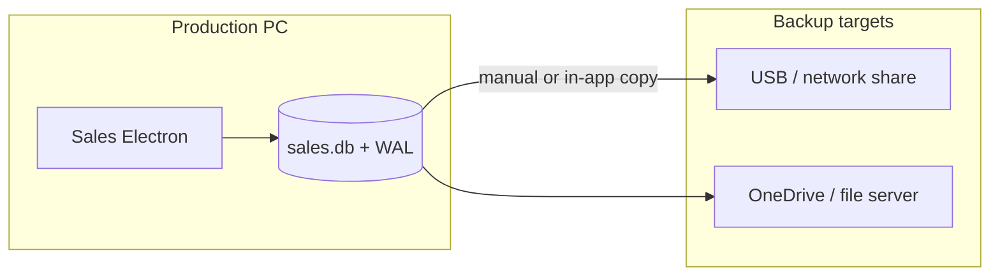
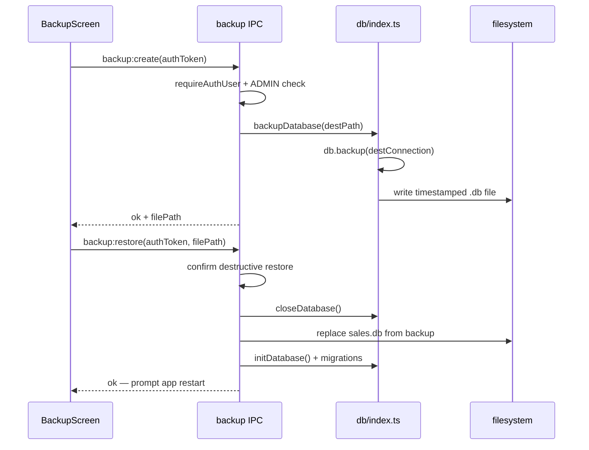

# Production data backup strategy

## Current state

All business data lives in one SQLite database opened at startup in [`src/electron/db/index.ts`](src/electron/db/index.ts):

```975:988:src/electron/db/index.ts
export function initDatabase(): Database.Database {
  // ...
  const dbPath = path.join(app.getPath("userData"), "sales.db");
  db = new Database(dbPath);
  db.pragma("journal_mode = WAL");
  db.pragma("foreign_keys = ON");
  runMigrations(db);
  seedDefaultPermissions(db);
  return db;
}
```

**What this means in production:**

| Item                         | Detail                                                                                    |
| ---------------------------- | ----------------------------------------------------------------------------------------- |
| Primary file                 | `{userData}/sales.db`                                                                     |
| WAL companions               | `sales.db-wal`, `sales.db-shm` (present while app is running)                             |
| Dev path (Windows)           | `%APPDATA%\sales-electron\`                                                               |
| Installed app path (Windows) | Likely `%APPDATA%\Sales Electron\` (from `productName` in [`package.json`](package.json)) |
| Existing exports             | Screen-level CSV/PDF only — **not** a full database backup                                |
| Existing restore             | None; [`scripts/db-reset.mjs`](scripts/db-reset.mjs) deletes the DB (dev only)            |



---

## Phase 1 — Operational backup (no code, deploy immediately)

Document and train IT staff on a **WAL-safe** manual procedure.

### Backup procedure

1. **Ask all users to close Sales Electron** on that PC (or schedule during off-hours).
2. Copy the entire userData folder (safest) or at minimum:
   - `sales.db`
   - `sales.db-wal` (if present)
   - `sales.db-shm` (if present)
3. Store copies on a **network share or synced folder** (OneDrive, NAS), not only on the same disk.
4. Name files with date + machine, e.g. `sales-backup-2026-07-20-PC01.db`.
5. Keep **retention**: e.g. daily for 7 days, weekly for 4 weeks, monthly for 12 months.

### Why the app must be closed

With `journal_mode = WAL`, copying only `sales.db` while the app is open can produce an **inconsistent** backup. Options when the app cannot be closed:

- Use SQLite online backup API (Phase 2 — recommended product feature), or
- Run `PRAGMA wal_checkpoint(FULL)` via a small utility while the DB is open (advanced; still prefer in-app backup)

### Restore procedure

1. Close Sales Electron completely.
2. **Rename** current files to `.old` (do not delete until restore is verified):
   - `sales.db` → `sales.db.old`
   - remove or rename `-wal` / `-shm` if present
3. Copy backup `sales.db` into userData.
4. Relaunch the app.
5. On a **newer app version**, migrations in [`src/electron/db/migrations/`](src/electron/db/migrations/) run automatically on startup — this is expected and safe when restoring an older DB to a newer app.
6. On an **older app version**, restoring a DB from a newer app may fail — always restore using the same or newer app version.

### Production checklist (IT)

- Identify the correct userData folder on each installed PC (`Sales Electron` vs `sales-electron`).
- Schedule nightly/off-hours backup via Windows Task Scheduler **after confirming the app is closed**, or use Phase 2 in-app backup during business hours.
- Test restore on a **non-production machine** quarterly.
- Include backup path in [`docs/user-guide/10-troubleshooting.md`](docs/user-guide/10-troubleshooting.md) and a new ops doc under `docs/`.

---

## Phase 2 — In-app backup/restore (recommended product feature)

Add a safe, ADMIN-only backup flow using SQLite’s **online backup** so operators can back up **while the app is running** without corruption.

### Architecture



### New backend module

Create [`src/electron/db/backup.ts`](src/electron/db/backup.ts):

- `getDatabasePath()` — expose `{ userData, dbPath }` for UI display
- `createBackup(destPath: string)` — use `better-sqlite3` `.backup()` to write a **single consistent** `.db` file (no separate WAL files needed in the backup)
- `restoreBackup(sourcePath: string)` — validate file is SQLite, close DB, copy backup over `sales.db`, delete stale `-wal`/`-shm`, reopen via `initDatabase()`

Key implementation notes:

- Reuse save-dialog pattern from [`src/electron/ipc/print.ts`](src/electron/ipc/print.ts) (`dialog.showSaveDialog` / `showOpenDialog`)
- Default backup filename: `sales-backup-YYYY-MM-DD-HHmm.db`
- Restore must show a strong confirmation (`dialog:confirm`) and require **app restart** after replace (simplest: `app.relaunch(); app.exit(0)`)

### IPC + preload

- New [`src/electron/ipc/backup.ts`](src/electron/ipc/backup.ts) with handlers:
  - `backup:getInfo` — userData path, DB size, last backup time (optional metadata file)
  - `backup:create` — authenticated, ADMIN-only
  - `backup:restore` — authenticated, ADMIN-only
- Register in [`src/electron/main.ts`](src/electron/main.ts)
- Expose `api.backup.*` in [`src/electron/preload.cjs`](src/electron/preload.cjs)
- Add types in a shared `backup.types.ts`

### UI placement

Add **Data backup** under the Organization section (alongside Company settings):

- Route id: `data-backup` in [`src/shared/routeCatalog.ts`](src/shared/routeCatalog.ts)
- Default permission: ADMIN write only (new row in permissions defaults + seed migration `035_*`)
- Screen: [`src/ui/organization/DataBackupScreen.tsx`](src/ui/organization/DataBackupScreen.tsx)
- Wire in [`src/ui/pages/HomeScreen.tsx`](src/ui/pages/HomeScreen.tsx)

Screen contents:

- Current database location (read-only)
- **Create backup** button → save dialog
- **Restore from backup** button → open dialog + confirm + restart
- Short warnings: restore replaces all data; CSV exports are not full backups

### Auth guard

Follow existing pattern in [`src/electron/ipc/auth.ts`](src/electron/ipc/auth.ts): `requireAuthUser(token)` plus role check (`ADMIN`) or a dedicated action key `manage_backups` in permissions.

---

## Phase 3 — Optional automation

If IT wants unattended backups without building a scheduler into the app:

- **Windows Task Scheduler** script that:
  1. Checks no `Sales Electron.exe` process is running
  2. Copies `%APPDATA%\Sales Electron\sales.db*` to a network path
  3. Logs success/failure
- Alternatively, once Phase 2 exists, a small PowerShell script could invoke a headless Electron helper — lower priority than in-app backup.

Do **not** rely on CSV/PDF exports from reports screens as disaster recovery; they are partial snapshots only.

---

## What to document

Add [`docs/user-guide/11-data-backup-restore.md`](docs/user-guide/11-data-backup-restore.md):

- Where data is stored
- Manual backup/restore steps (Phase 1)
- In-app backup steps (Phase 2)
- Migration behavior after restore
- Troubleshooting: wrong folder, corrupt backup, app version mismatch

Cross-link from [`docs/user-guide/10-troubleshooting.md`](docs/user-guide/10-troubleshooting.md) and [`docs/developer-guide/02-dev-setup.md`](docs/developer-guide/02-dev-setup.md).

---

## Risk summary

| Risk                         | Mitigation                                                    |
| ---------------------------- | ------------------------------------------------------------- |
| Copying DB while app is open | Use `.backup()` API (Phase 2) or close app first (Phase 1)    |
| Restore to wrong PC path     | Show userData path in UI; document both dev/prod folder names |
| Data loss on restore         | Require confirmation; keep `.old` rename before overwrite     |
| Newer schema after restore   | Existing migration runner handles upgrade on next launch      |
| Unauthorized restore         | ADMIN-only + confirmation dialog                              |

---

## Recommended rollout

1. **Week 1:** Publish Phase 1 ops doc; IT starts scheduled folder copies with app closed.
2. **Week 2–3:** Implement Phase 2 in-app backup/restore (small, focused change set: ~5–7 files).
3. **Ongoing:** Quarterly restore drill on a spare PC; adjust retention policy per company policy.

Estimated implementation for Phase 2: **1–2 days** including UI, IPC, permissions, and docs.
