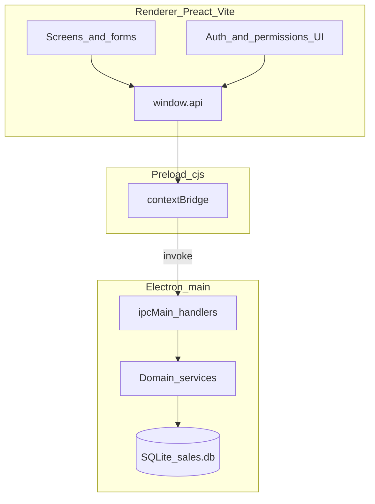

# Architecture

## High-level

## Process boundaries

- **Renderer** (`src/ui/`) — presentation only. It must not open SQLite directly.
- **Preload** (`src/electron/preload.cjs`) — exposes a curated `window.api` surface; no Node integration in the page.
- **Main** (`src/electron/main.ts`) — creates the `BrowserWindow`, initializes the DB, registers IPC handlers, handles print/dialogs.

## Startup sequence

1. `app.whenReady`
2. `Menu.setApplicationMenu(null)` — hide the default application menu
3. `initDatabase()` — open `userData/sales.db`, run migrations, seed default permissions
4. `backfillFinancialMonths()` — ensure month rows exist for open financial years
5. Register IPC modules (auth, db, sales, deliveryOrders, stock, reports, financial years, dashboard, carry-forward, print, …)
6. Create `BrowserWindow` with title **Sales Management Application**; load Vite dev URL or production `dist-react` index

Window chrome title is set on `BrowserWindow` and in `index.html`. Packaged `productName` / Start Menu shortcut remain **Sales Electron** (see [Build and packaging](09-build-and-packaging.md)).

## Shared types

Cross-cutting TypeScript types live under `src/shared/` (routes, permissions, report payloads, sales types). Main imports them as `.js` emit paths; the UI imports `.ts` sources via Vite.

## Design rules

- Business rules and SQL belong in `src/electron/**` services.
- UI calls authenticated wrappers (e.g. `getAuthenticatedReports()`) that attach the session token.
- Reports are pure builders: load settings + query DB → typed payload → Preact document component for screen/print pack.
